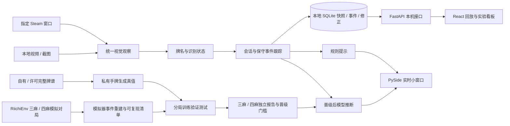

# 架构设计 · 0.3

`vision` 只输出观察，不猜测隐藏手牌；`application` 处理会话、观察稳定性、事件与推断门槛；`domain` 实现规则与已知手牌的精确牌型真值；`ml` 负责牌谱格式、公开特征、训练和测试；`infrastructure` 管理窗口读取与私有本地数据；`web` 和 `ui` 只展示同一条状态流。

事件追踪只从完整、连续稳定的牌河变化生成确定性出牌；横置牌记为疑似立直，牌河减少记为副露候选。中途接入、未知牌、乱序、动画、截取失败都会标明不确定并暂停模型推断。当前新一局检测依赖空牌河和新手牌，仍需更多真实客户端样本验证；可以用“新一局”按钮显式重置。

Web 服务默认绑定 `127.0.0.1:8765`，只提供结构化事件、汇总指标和纠错接口；原始截图和视频不通过接口提供。训练数据和模型权重默认不发布。现有本地复盘助手使用证据引用和规则边界，不调用外部大语言模型。

RiichiEnv 是独立的模拟数据源，采用 Apache-2.0 许可的开源库。它不提供雀魂真人对局的准确率证据。完整事件日志是精确重建的输入；模拟器版本、规则、策略和数据摘要写入实验报告，公开仓库附压缩后的纯模拟日志、生成代码和说明。
